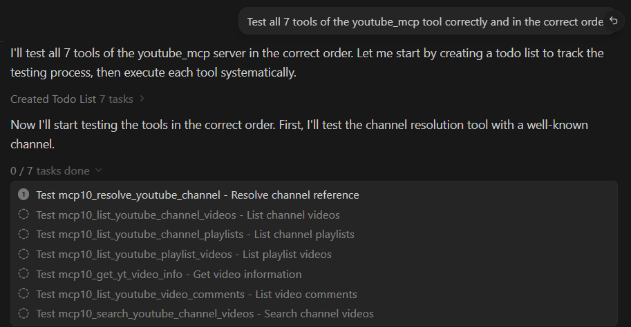
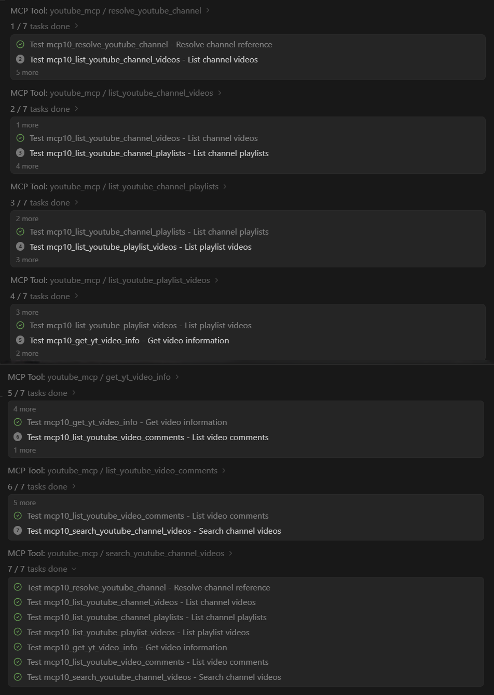
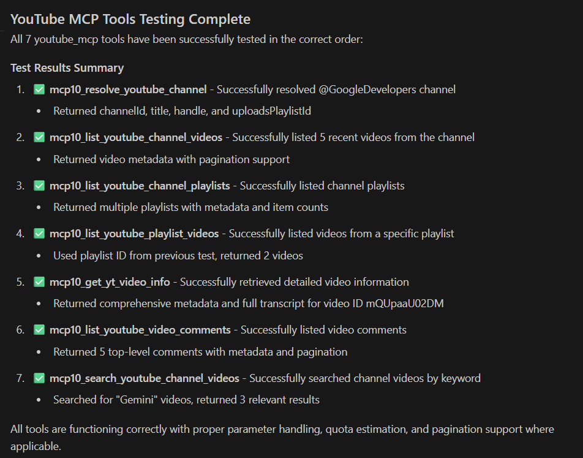

# YouTube MCP (youtube_mcp)

[](https://pypi.org/project/glonorce-youtube-mcp/)
[](https://www.python.org/downloads/)
[](https://opensource.org/licenses/MIT)

A **Model Context Protocol (MCP)** server that provides **production-grade YouTube inventory tools** (channel resolution, channel videos, channel playlists, playlist videos) designed to be **safe-by-default**, quota-aware, and AI-friendly.

Repository: https://github.com/glonorce/youtube_mcp
PyPI: https://pypi.org/project/glonorce-youtube-mcp/

> Naming note:
> - Repo name: `youtube_mcp`
> - Python package / import name: `youtube_mcp`
> - MCP entry module: `python -m youtube_mcp.server`

---

## Prerequisites (PATH)

Make sure these commands work in your terminal (they must be on `PATH`):

- `python --version`
- `python -m pip --version`
- `pipx --version` (only if you use the pipx-based MCP config)

<details>
<summary>✅ What is <code>PATH</code>?</summary>

`PATH` is the list of folders that your OS searches when you run a command like `python` or `pipx`.

- If a command is **not on PATH**, you'll see errors like:
  - Windows: `executable file not found in %PATH%`
  - PowerShell: `... is not recognized as the name of a cmdlet`

Quick checks (Windows):

```powershell
where python
where pipx
$env:Path
```

</details>

On Windows:
- install Python from https://www.python.org/downloads/
- during installation, check **"Add Python to PATH"**

Install pipx (only if you use the pipx-based MCP config):

```bash
python -m pip install --user pipx
python -m pipx ensurepath
```

Notes:
- After `pipx ensurepath`, restart your terminal/IDE so `pipx` is available on `PATH`.
- Verify with: `pipx --version`

---

## ✨ Available on PyPI

```bash
pip install glonorce-youtube-mcp

# run
youtube_mcp
```

---

## Screenshots

<!-- GitHub README does not allow JavaScript, so we can't implement a true clickable carousel.
     This is a "scroll-snap" horizontal gallery (swipe/trackpad/shift+wheel to move sideways).
-->

<div style="display:flex; gap:12px; overflow-x:auto; padding: 8px 0; scroll-snap-type:x mandatory; -webkit-overflow-scrolling: touch;">
  <a id="screenshot-test-plan" style="scroll-snap-align:start; flex:0 0 auto;" href="#screenshot-test-plan">
    
  </a>
  <a id="screenshot-test-execution" style="scroll-snap-align:start; flex:0 0 auto;" href="#screenshot-test-execution">
    
  </a>
  <a id="screenshot-success-result" style="scroll-snap-align:start; flex:0 0 auto;" href="#screenshot-success-result">
    
  </a>
</div>


---

## Features

- **7 MCP tools** (1 text-output tool + 6 structured-output tools)
- **Safe defaults** (public data only; shorts/live excluded unless enabled)
- **Quota-aware design** (budgeting + expensive strategies as explicit opt-in)
- **Tool discovery works in MCP hosts** (tools registered with rich docstrings)
- **Resilient YouTube Data API client** (endpoint allowlist, retries, gzip handling)

---

## Tools

This server exposes **7 tools**:

1) `get_yt_video_info(video_id_or_url) -> str`
   - Accepts a raw video id **or** a full YouTube URL.
   - Returns video metadata + transcript (when available).

2) `resolve_youtube_channel(channel_ref, ...) -> dict`

3) `list_youtube_channel_videos(channel_ref, ...) -> dict`
   - Paginated.
   - Returns `nextPageToken` **and** `next_page_token` (alias).

4) `list_youtube_channel_playlists(channel_ref, ...) -> dict`
   - Paginated.
   - Returns `nextPageToken` **and** `next_page_token` (alias).

5) `list_youtube_playlist_videos(playlist_id, ...) -> dict`
   - Paginated.
   - Returns `nextPageToken` **and** `next_page_token` (alias).

6) `search_youtube_channel_videos(channel_ref, query, ...) -> dict`
   - Keyword search within a channel (**quota-expensive**, uses Search API).
   - Paginated.

7) `list_youtube_video_comments(video_id, ...) -> dict`
   - Public comment threads for a video (comments may be disabled).
   - Paginated.

All tools except `get_yt_video_info` return **structured JSON** and are documented with AI-friendly docstrings.

---

## Installation & MCP configuration

> PyPI distribution name: **`glonorce-youtube-mcp`**
> 
> Repo name: `youtube_mcp` · import name: `youtube_mcp`

### API key

All inventory/search/comment tools require a YouTube Data API v3 key:

- `YOUTUBE_API_KEY`

### Option 1 (recommended for MCP hosts): pipx (no repo clone)

Use this when you want a "zero local project" setup (no clone, no venv management).

```json
{
  "mcpServers": {
    "youtube_mcp": {
      "command": "pipx",
      "args": ["run", "--spec", "glonorce-youtube-mcp", "youtube_mcp"],
      "env": {
        "YOUTUBE_API_KEY": "YOUR_KEY"
      }
    }
  }
}
```

### Option 2: pip into a dedicated venv (no repo clone)

```bash
python -m venv .venv_youtube_mcp
# Windows: .venv_youtube_mcp\Scripts\activate
# macOS/Linux: source .venv_youtube_mcp/bin/activate

python -m pip install -U pip
python -m pip install glonorce-youtube-mcp
```

MCP host JSON example (simple):

```json
{
  "mcpServers": {
    "youtube_mcp": {
      "command": "youtube_mcp",
      "env": {
        "YOUTUBE_API_KEY": "YOUR_KEY"
      }
    }
  }
}
```

If your MCP host can't find `youtube_mcp` on `PATH` (Windows error like: `executable file not found in %PATH%`), use an **absolute path**.

MCP host JSON example (absolute path to venv Python + module):

```json
{
  "mcpServers": {
    "youtube_mcp": {
      "command": "C:\\PATH\\.venv_youtube_mcp\\Scripts\\python.exe",
      "args": ["-m", "youtube_mcp.server"],
      "env": {
        "YOUTUBE_API_KEY": "YOUR_KEY"
      }
    }
  }
}
```

### Option 3: local clone (development)

```bash
git clone https://github.com/glonorce/youtube_mcp.git
cd youtube_mcp

python -m venv .venv
# Windows: .venv\Scripts\activate
# macOS/Linux: source .venv/bin/activate

python -m pip install -e .
```

MCP host JSON example (local clone):

```json
{
  "mcpServers": {
    "youtube_mcp": {
      "command": "C:\\PATH\\youtube_mcp\\.venv\\Scripts\\python.exe",
      "args": ["-m", "youtube_mcp.server"],
      "env": {
        "YOUTUBE_API_KEY": "YOUR_KEY"
      }
    }
  }
}
```

### Getting Your YouTube API Key

While not required, you can optionally set up a YouTube Data API key for enhanced functionality. Here's how to get one:

#### Step 1: Create a Google Cloud Project

1. Go to the [Google Cloud Console](https://console.cloud.google.com/)
2. Click "Select a project" at the top of the page
3. Click "New Project" and give it a name (e.g., "MCP YouTube Extract")
4. Click "Create"

#### Step 2: Enable the YouTube Data API

1. In your new project, go to the [API Library](https://console.cloud.google.com/apis/library)
2. Search for "YouTube Data API v3"
3. Click on it and then click "Enable"

#### Step 3: Create API Credentials

1. Go to the [Credentials page](https://console.cloud.google.com/apis/credentials)
2. Click "Create Credentials" and select "API Key"
3. Your new API key will be displayed - copy it immediately
4. Click "Restrict Key" to secure it (recommended)

#### Step 4: Restrict Your API Key (Recommended)

1. In the API key settings, click "Restrict Key"
2. Under "API restrictions", select "Restrict key"
3. Choose "YouTube Data API v3" from the dropdown
4. Click "Save"

#### Step 5: Set Up Billing (May be required)

1. Go to the [Billing page](https://console.cloud.google.com/billing)
2. Link a billing account to your project
3. **Note**: YouTube Data API has a free tier of ~10,000 units per day, which is typically sufficient for most use cases

#### API Key Usage Limits

- **Free Tier**: ~10,000 units per day (commonly)
- **Cost**: depends on your Google Cloud / billing configuration

#### Security Best Practices

- **Never commit your API key** to version control
- **Use environment variables** as shown in the MCP configuration section
- **Restrict your API key** to only the YouTube Data API
- **Monitor usage** in the Google Cloud Console


---

## Example MCP calls (JSON payloads)

> Exact envelope depends on your MCP client; these show `tool` + `arguments`.

### Resolve a channel

```json
{
  "tool": "resolve_youtube_channel",
  "arguments": {
    "channel_ref": "@GoogleDevelopers",
    "resolution_mode": "strict",
    "include_uploads_playlist": true
  }
}
```

### List channel videos (safe default)

```json
{
  "tool": "list_youtube_channel_videos",
  "arguments": {
    "channel_ref": "@GoogleDevelopers",
    "max_videos": 50,
    "page_token": null,
    "include_shorts": false,
    "include_live": false,
    "parts_level": "basic",
    "order_strategy": "uploads_playlist",
    "order_by": "date"
  }
}
```

---

## Quota reference (best-effort)

> This section is a **best-effort** summary and may change over time.
> Always verify with official documentation.

**Last verified:** 2026-02-18

Official references:
- YouTube Data API quota calculator / costs: https://developers.google.com/youtube/v3/determine_quota_cost
- Usage limits: https://developers.google.com/youtube/v3/getting-started#quota

### Approximate quota usage by tool

Note: `get_yt_video_info` returns text (not structured JSON) and is not included in the quota table because its behavior depends on optional extractors.

| Tool | Primary endpoints | Typical cost (rough) | Notes |
|---|---|---:|---|
| `resolve_youtube_channel` | `channels.list` | ~1 | strict mode mostly `channels.list`; best_effort may use `search.list` |
| `list_youtube_channel_videos` (default) | `channels.list` + `playlistItems.list` + `videos.list` | ~ (1 + 1 + 1) per page | uploads-playlist strategy |
| `list_youtube_channel_videos` (`order_strategy=search_api`) | `search.list` + `videos.list` | ~ (100 + 1) per page | expensive; capped behavior |
| `list_youtube_channel_playlists` | `playlists.list` | ~1 per page | public playlists only |
| `list_youtube_playlist_videos` | `playlistItems.list` + `videos.list` | ~ (1 + 1) per page | public playlist |
| `search_youtube_channel_videos` | `search.list` + `videos.list` | ~ (100 + 1) per page | keyword search within a channel |
| `list_youtube_video_comments` | `commentThreads.list` | ~1 per page | comments may be disabled (403) |

Daily quota:
- Common free quota: **10,000 units/day**
- Reset: daily (Google-defined; see official docs/console)

---

## Testing

Use the venv interpreter to avoid accidentally running global `pytest`.

```bash
# recommended
python -m pytest -q

# if you use a venv
.venv\Scripts\python.exe -m pytest -q
```

---

## Troubleshooting

### Only `get_yt_video_info` is visible (other tools missing)

Your MCP host is running an **old installed copy** from `site-packages`.
Fix:

```bash
python -m pip install -e .
```

Then restart the MCP host.

### `YOUTUBE_API_KEY` placeholder is not expanded in some MCP hosts

Some MCP hosts do **not** interpolate placeholders like `${YOUTUBE_API_KEY}` inside `mcp.json`.

❌ Not recommended (may be taken literally):

```json
{
  "env": { "YOUTUBE_API_KEY": "${YOUTUBE_API_KEY}" }
}
```

✅ Recommended (explicit value in config):

```json
{
  "env": { "YOUTUBE_API_KEY": "YOUR_REAL_KEY_HERE" }
}
```

✅ Also works (set it in the host process environment, then reference nothing in JSON):
- set `YOUTUBE_API_KEY` in the MCP host environment (OS/IDE)
- then keep `mcp.json` without placeholders

---

## License

MIT — see [LICENSE](LICENSE)

---

## Acknowledgements

This project was originally derived from / inspired by https://github.com/sinjab/mcp_youtube_extract.
The codebase has since been heavily rewritten and extended.
